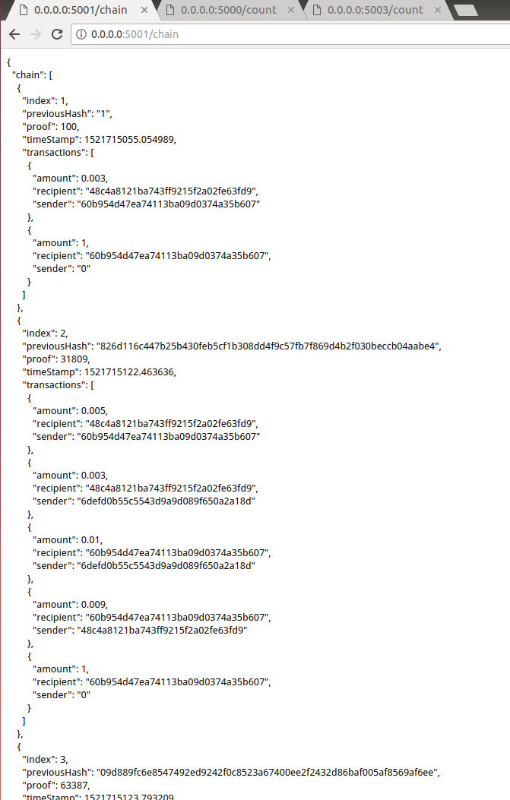

# 最小化的区块链系统

> 通过实现一遍区块链的最小系统来学习和了解区块链的运作方式。在该项目中对区块链的多各节点的实现中进行了部分简化，使用一个network服务来模拟网络环境中的路由和广播。
该项目是以论文作为基础，加入了自己的一些理解，做出了部分的简化和修改；如果发现了错误或者问题，请与作者联系


## 运行环境
linux环境下测试

python 2.7

Flask(0.12.2)

requests(2.18.4)


## 项目的使用
    ```
    # 启动模拟网络，加入3个节点
    python main.py -n 3 -t simulation

    # 加入新的节点
    python main.py -t add

    # 停止所有服务
    # python main.py -t kill
    ```

## 区块链的信息查看

* 使用浏览器查看区块链信息和账户信息，端口号默认由5000开始随节点增加依次递增




* 通过控制台进行查看

```
curl -X GET -H "Content-Type: application/json" 'http://0.0.0.0:5000/chain'
```


## 区块的构造
 * 区块的信息格式

 一个区块本质上是一个消息块，记录的内容包括：区块的序列号、时间戳、该区块生成时间内搜集到的交易信息列表、PoW工作量算法的验证消息以及前一个区块的hash值。

 以下是一个区块的示例样式：
 ```
{
      "index": 3,
      "previousHash": "03f2f7338a0ebdec4fbb1030a6f5c2efb75de8374c361131f3c76374371244e4",
      "proof": 13633,
      "timeStamp": 1521626562.525675,
      "transactions": [
        {
          "amount": 0.0,
          "recipient": "3454d1fee67d456f8218de585bfa52ca",
          "sender": "254e8859e8eb4b498b033364fa483876"
        },
        {
          "amount": 0.009,
          "recipient": "3454d1fee67d456f8218de585bfa52ca",
          "sender": "254e8859e8eb4b498b033364fa483876"
        },
        {
          "amount": 0.009,
          "recipient": "4decd3b3e43f4c4584a589a37dd9cb30",
          "sender": "254e8859e8eb4b498b033364fa483876"
        },
        {
          "amount": 0.004,
          "recipient": "254e8859e8eb4b498b033364fa483876",
          "sender": "3454d1fee67d456f8218de585bfa52ca"
        },
        {
          "amount": 0.006,
          "recipient": "254e8859e8eb4b498b033364fa483876",
          "sender": "4decd3b3e43f4c4584a589a37dd9cb30"
        },
        {
          "amount": 0.008,
          "recipient": "4decd3b3e43f4c4584a589a37dd9cb30",
          "sender": "254e8859e8eb4b498b033364fa483876"
        },
        {
          "amount": 0.0,
          "recipient": "254e8859e8eb4b498b033364fa483876",
          "sender": "4decd3b3e43f4c4584a589a37dd9cb30"
        },
        {
          "amount": 0.002,
          "recipient": "3454d1fee67d456f8218de585bfa52ca",
          "sender": "4decd3b3e43f4c4584a589a37dd9cb30"
        },
        {
          "amount": 0.008,
          "recipient": "3454d1fee67d456f8218de585bfa52ca",
          "sender": "4decd3b3e43f4c4584a589a37dd9cb30"
        },
        {
          "amount": 0.002,
          "recipient": "4decd3b3e43f4c4584a589a37dd9cb30",
          "sender": "254e8859e8eb4b498b033364fa483876"
        },
        {
          "amount": 0.002,
          "recipient": "254e8859e8eb4b498b033364fa483876",
          "sender": "4decd3b3e43f4c4584a589a37dd9cb30"
        },
        {
          "amount": 1,
          "recipient": "3454d1fee67d456f8218de585bfa52ca",
          "sender": "0"
        }
      ]
    }
```

 * 构造哈希链

 在每个区块中记录了前一个区块的hash值和改序号，使得整个数据呈链式连接；而通过哈希链的算法的单向性质，保证了整个链条上的值具有不可篡改性，避免了使用的非法的数据对整个区块链进行恶意的攻击；

 * 打包交易信息

 当一个节点发掘到一个新的区块的时候，需要将节点当前收集到的交易信息以及发现区块得到的奖励一起打包加入到区块的交易信息中进行发布；奖励的来源为'0'。

    *  在实际中每当一个新区块加入主链，这个区块的发行者就会被赠与50个BTC；每21万个区块后，奖励额度缩水一半；
    *  而在项目中我们将简化为，每个打包奖励数量为1
 ```
    [
        # 区块奖励信息
         {
          "amount": 1,
          "recipient": "3454d1fee67d456f8218de585bfa52ca",
          "sender": "0"
        },
        # 区块收集到的
         {
          "amount": 0.002,
          "recipient": "254e8859e8eb4b498b033364fa483876",
          "sender": "4decd3b3e43f4c4584a589a37dd9cb30"
        },
        ...
     ]
 ```

 * 理解最大工作量算法的实现（PoW）

 最大工作量算法是区块链系统形成新区块的一种方法，是使用算力限制区块产生的速度，并且保证区块产生的可验证性。比特币系统要求，每个用户在发布新区块前，必须先完成一个任务。这个任务就是：

    * 根据前一区块的一些信息加上新区快的一些信息，生成一个字符串S；

    * 选择一个字符串B，与S合并成“BC”，且要求“BC”的哈希映射满足某个条件，比如映射结果的前72位为0（概率：2^(-72)）；

 上面的第2步，除了遍历数字的方式以外是没有捷径的，最后虽然能试出来，但也会花费大量时间。而且当你将结果进行广播后，其他用户也可以很快验证你的结果是否正确。

 最先完成PoW的节点

 代码实现,在项目中以四个零开头的proof作为一个示例：
 ```
        def proof_of_work(self, last_block):
        """
        寻找符合工作量证明的proof,使用的算法如下：
         - 找到一个proof，使得hash(proof||previous_proof||previous_hash) 的值是以4个零开头
         - 4个零开头的规则是示例规则
        :param last_block: 前一个区块
        :return: proof
        """

        previous_proof = last_block['proof']
        previous_hash = self.hash(last_block)

        proof = 0
        while self.valid_proof(previous_proof, proof, previous_hash) is False:
            proof += 1

        return proof

        @staticmethod
        def valid_proof(previous_proof, proof, previous_hash):
            """
            验证proof有效性
            :param previous_proof:
            :param proof:
            :param previous_hash: 前一个区块的hash值
            :return: proof的有效性 bool
            """

            # guess = '{previous_proof}{proof}{previous_hash}'.format(previous_proof=previous_proof, proof=proof, previous_hash=previous_hash)
            guess = str(previous_proof) + str(proof) + str(previous_hash)
            guess_hash = hashlib.sha256(guess).hexdigest()
            return guess_hash.startswith('0000')
 ```

 * 冲突的解决、

 当不同的节点之间新出现的区块出现了冲突的时候，区块链验证中最核心的思想就是相信最长的区块链；当一个攻击想要在区块链中添加一个伪造交易信息的区块时，需要有比诚实更大
 的概率产生新的区块


 ## 模拟区块链在网络中的生成过程

 * 区块链分布式网络的运行步骤

    * 新的交易向全网进行广播；
    * 节点将收到的交易收纳到一个区块之中；
    * 每个节点都尝试在自己的区块中找到一个具有足够难度的工作量证明；
    * 当一个节点找到一个工作量证明，就向全网进行广播；
    * 每个节点收到新的区块的时候会进行有效性验证和冲突处理；验证后会将收到的区块加在自己的区块末尾

 * 构造矿工节点的服务

    在项目中我们将使用服务的形式来模拟一个矿工节点在区块链生成过程中的作用，并使用API的的方法来进行通信和节点的行为控制；API的内容主要包括以下的几个方法：

    * /mine 探索一个新的区块
    * /chain 返回一个节点的区块链数据
    * /chain/resolve 该节点和其他节点之间的区块冲突解决
    * /transactions/new 接受交易信息
    * /nodes/register 注册邻居节点，用来解决区块链冲突
    * /count 根据区块链信息返回当前所有用户的余额

 * 构造虚拟网络拓扑

    在项目中使用服务来模拟网络拓扑和路由的功能

    * /register 在网络中注册新的节点
    * /freshChain 广播到所有节点，进行冲突处理
    * /transactions/new 接收交易信息，广播给所有注册节点
    * /transactions/random 产生一个随机交易信息进行广播


